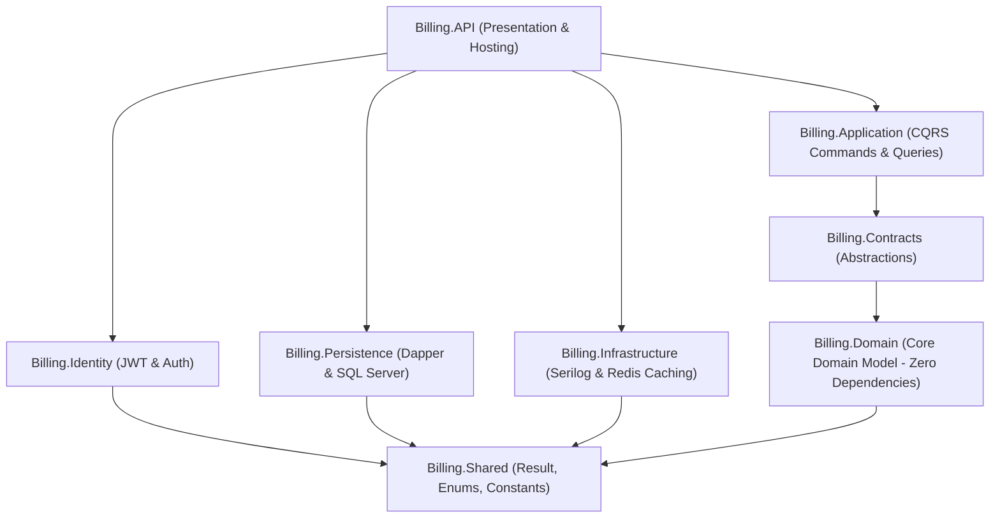

# 🛒 Multi-Tenant Billing, POS, Inventory & Shop Management SaaS - Complete Project Analysis

**Generated Date:** August 8, 2026  
**Project Path:** `d:\Projects\ERP\NewShop`  
**System Status:** 🟢 **Active & Running** (API: `http://localhost:5000`, Frontend: `http://localhost:5173`)

---

## 📋 1. Executive Summary

This project is an enterprise-grade, multi-tenant **SaaS Application** for small-to-medium businesses (SMBs) covering **Point of Sale (POS)**, **Inventory Control**, **Purchases**, **Supplier/Customer Management**, **Financial Reporting (P&L, GST, Sales)**, and **Interactive Business Dashboards**.

The solution follows strict **Clean Architecture** principles in .NET 9, pairing a high-performance **Dapper** micro-ORM persistence layer with a modern **React 18 + Vite + Material UI** frontend.

---

## 🏗️ 2. High-Level Architecture Overview

### Clean Architecture Layers

### Layer Breakdown

| Project Name | Purpose & Function | Key Technologies |
| :--- | :--- | :--- |
| **`Billing.Domain`** | Enterprise domain models, entities, enums, value objects. Zero external dependencies. | C# 13 Records, Enums |
| **`Billing.Contracts`** | Application contracts, interface definitions (`IUnitOfWork`, `ITenantContext`, `ICacheService`). | C# Interfaces |
| **`Billing.Application`** | Business logic implementation via CQRS pattern. Handlers, DTOs, Validators, AutoMapper profiles. | MediatR, FluentValidation, AutoMapper |
| **`Billing.Persistence`** | Data access layer built entirely with Dapper (no EF Core). Implements tenant filtering, transactions, stored procedures. | Dapper, System.Data.SqlClient |
| **`Billing.Identity`** | Authentication & security management. Password hashing (PBKDF2), JWT access tokens, refresh token rotation. | ASP.NET Core Identity (Crypto), System.IdentityModel.Tokens.Jwt |
| **`Billing.Infrastructure`** | Cross-cutting concerns: Distributed caching, current user context resolution, structured logging. | Redis (StackExchange.Redis), Serilog |
| **`Billing.Shared`** | Cross-cutting primitive utilities: `Result<T>` pattern, custom exceptions, global constants. | C# 13 |
| **`Billing.API`** | Composition root, ASP.NET Core Web API, Middleware pipeline, Swagger/OpenAPI docs, CORS policies. | .NET 9 Web API, Swashbuckle |

---

## 💾 3. Database & Persistence Architecture

- **Database Engine:** SQL Server 2022 (`BillingSystem` database)
- **Data Access Layer:** **Dapper Micro-ORM** (all database queries write direct parameterized T-SQL or invoke Stored Procedures for optimal execution speed).
- **Multi-Tenancy Isolation Strategy:** Single shared database with row-level `TenantId` partitioning. Every database query automatically appends `@TenantId` filtering via `TenantContext`.
- **Concurrency Control:** Optimistic concurrency implemented using `RowVersion` (`ROWVERSION` column) on domain entities.

### Schema Statistics

- **Total Tables:** 29 normalized tables (e.g., `Tenants`, `Plans`, `Users`, `Roles`, `Products`, `Categories`, `Inventory`, `StockMovements`, `Sales`, `SaleItems`, `Purchases`, `PurchaseItems`, `Payments`, `Customers`, `Suppliers`, `AuditLogs`).
- **Stored Procedures:** 10 procedures for heavy analytical aggregations (Dashboard stats, Sales summaries, Stock valuations).
- **Global Data Seed:** Plans (Free, Pro, Enterprise), Roles (SuperAdmin, Admin, Manager, Cashier, StockManager), 19 fine-grained permissions.

---

## 🎨 4. Frontend Architecture & Features

The web frontend is a Single Page Application (SPA) located in `/frontend`.

### Tech Stack & Libraries

- **Framework:** React 18 with TypeScript 5
- **Build Tool:** Vite 6
- **UI & Theming:** Material UI 6 (Custom styled components, dark/light theme support)
- **State Management:** 
  - **Redux Toolkit:** Client state (Authentication slice, user sessions, tokens)
  - **React Query 3:** Server state caching, asynchronous API synchronization
- **Form Management:** React Hook Form + Yup validation schema
- **Routing:** React Router v6 (Protected routes, Permission-based access control)
- **Data Visualization:** Recharts (Revenue trends, top selling products)

### User Capabilities & Page Modules

1. **Authentication:** Register Tenant, User Login, JWT refresh handler, Session Lockout.
2. **Point of Sale (POS):** Fast barcode/search lookup, cart calculations, instant discounts, multi-payment options, invoice generation.
3. **Inventory Management:** Per-shop stock levels, stock movement history (Sales, Purchases, Adjustments, Initial), low-stock warning indicators.
4. **Products Catalog:** CRUD management for products, brands, categories, tax rates, unit measurements, and SKUs.
5. **Sales & Orders:** Transaction history, sale cancellation, receipt reprint, payment tracking.
6. **Purchases & Suppliers:** Supplier purchase order management, receiving inventory, supplier contact lists.
7. **Customers & Loyalty:** Customer directory, credit balance tracking, loyalty points engine.
8. **Reports & Analytics:** P&L statements, GST tax breakdowns, Sales reports, Top product analytics with CSV export.
9. **Tenant Settings:** Shop branch management, tax settings, user roles, permission management.

---

## 🔒 5. Security & Authorization Framework

1. **Authentication Protocol:** JWT Access Tokens (15 min lifespan) + Refresh Tokens (7 days lifespan, automatic token rotation on expiry).
2. **Password Security:** PBKDF2 password hashing (ASP.NET Core Identity algorithm) with account lockout after 5 consecutive failed attempts.
3. **Authorization System:** Role-Based Access Control (RBAC) & Fine-Grained Permissions (5 System Roles × 19 Permissions).
4. **Tenant Scoping Middleware:** `TenantContextMiddleware` extracts JWT claims (`tenant_id`, `user_id`, `shop_id`) and binds them into scoped `ITenantContext` for every incoming HTTP request.
5. **API Security:** Serilog structured logging, request rate-limiting, CORS origin restrictions, security headers.

---

## 🧪 6. Testing & Quality Assurance

- **Unit Tests (`Billing.UnitTests`):**
  - Validation rules testing (`ValidatorTests.cs`)
  - Command Handlers testing (`CreateSaleHandlerTests.cs`, `CancelSaleHandlerTests.cs`)
  - Exception and Result wrapper testing (`ResultTests.cs`)
- **Integration Tests (`Billing.IntegrationTests`):**
  - WebApplicationFactory API endpoint integration tests (`ApiIntegrationTests.cs`)
- **End-to-End E2E Tests:**
  - Playwright setup configured in `/frontend` (`playwright`).

---

## 🐳 7. Infrastructure & Containerization

The project supports containerization via Docker and Docker Compose (`docker-compose.yml`):

| Container Name | Service | Exposed Port | Role / Description |
| :--- | :--- | :--- | :--- |
| `billing-db` | SQL Server 2022 | `1433` | Primary transactional database |
| `billing-redis` | Redis 7 Alpine | `6379` | Distributed cache service |
| `billing-api` | .NET 9 Web API | `5000` | Backend REST API & Business Logic |
| `billing-frontend` | Nginx + React SPA | `8081` | Production Web UI frontend |

---

## ⚡ 8. Application Status & Live Verification

Both the backend API and frontend SPA have been initialized and verified running on the local host:

- 🟢 **Backend API:** `http://localhost:5000`
  - **Health Endpoint:** `http://localhost:5000/health` (Status: `Healthy`)
  - **Swagger API Docs:** `http://localhost:5000/swagger`
- 🟢 **Frontend Web App:** `http://localhost:5173`
  - **Vite Server Status:** HTTP `200 OK`

---

## 🎯 9. Key Recommendations & Next Steps

1. **Database Initialization:** Run the database scripts (`database/01_Schema.sql`, `02_StoredProcedures.sql`, `03_SeedData.sql`) against your local SQL Server instance if connecting outside Docker.
2. **Environment Variables:** For production deployment, update `.env` with strong database passwords and a secure JWT secret key (minimum 32 characters).
3. **CI/CD Integration:** Set up GitHub Actions or Azure DevOps pipelines to execute `dotnet test` and `npm run test` automatically on pull requests.
