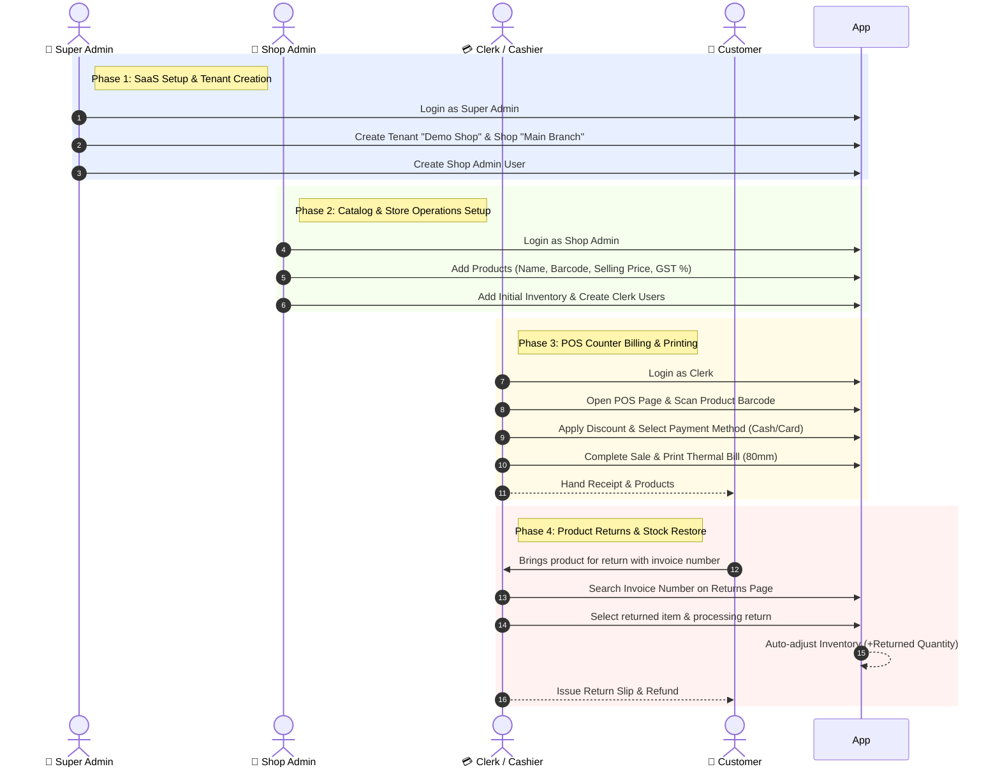

# 🛒 Multi-Tenant SaaS Billing System - User Guide & Workflow Document

**Document Version:** 1.0  
**Application URL:** [http://localhost:5173](http://localhost:5173)  
**API Documentation:** [http://localhost:5000/swagger](http://localhost:5000/swagger)  
**Database Name:** `BillingSystem` (SQL Server Instance: `SUSHANT`)

---

## 🔑 1. Role Hierarchy & Credentials Directory

| Role Name | Access Level | Demo Email | Password | Primary Responsibilities |
| :--- | :--- | :--- | :--- | :--- |
| 👑 **Super Admin** | System-Wide (All Shops) | `admin@billingsystem.com` | `Admin@123` | Create & manage tenants, assign shop plans, view consolidated SaaS analytics. |
| 🏪 **Shop Admin** | Single Shop Management | `shopadmin@demo.com` | `ShopAdmin@123` | Product catalog CRUD, stock level management, clerk account creation, shop reports. |
| 💳 **Clerk / Cashier** | POS Counter & Register | `clerk@demo.com` | `Clerk@123` | Quick barcode POS billing, bill reprints, processing product returns, printing receipts. |

> **Tenant Slug:** Leave blank for default demo store (or enter `demo-shop` when prompted).

---

## 🔄 2. End-to-End User Workflows



---

## 📋 3. Detailed Step-by-Step Flow Instructions

### 👑 Flow 1: Super Admin (Global Operations)

1. Navigate to **[http://localhost:5173](http://localhost:5173)**.
2. Sign in with **`admin@billingsystem.com`** / **`Admin@123`**.
3. **Dashboard:** View consolidated revenue across all registered shop tenants, total system sales count, and subscription stats.
4. **Tenant Management:** Create new shop tenants, edit subscription tiers (Starter, Pro, Enterprise), or suspend inactive stores.

---

### 🏪 Flow 2: Shop Admin (Store Operations & Inventory)

1. Sign in as Shop Admin (**`shopadmin@demo.com`** / **`ShopAdmin@123`**).
2. **Product Catalog Setup:**
   - Go to **Products** (`/products`) → Click **+ Add Product**.
   - Fill in: **Product Name**, **SKU / Barcode**, **Cost Price**, **Selling Price**, **GST Tax %**, and **Opening Stock**.
   - Save product. Barcode is indexed for instant POS scanner lookup.
3. **Clerk User Management:**
   - Go to **Settings** → **Users** → Add Cashier/Clerk accounts.
4. **Inventory Valuation & Low-Stock Monitoring:**
   - Go to **Reports** → View low-stock warning items (items below reorder threshold).

---

### 💳 Flow 3: Clerk / Cashier (Quick POS Billing)

1. Sign in as Clerk (**`clerk@demo.com`** / **`Clerk@123`**).
2. Go to **POS** (`/pos`).
3. **Item Entry:**
   - **Barcode Scanner:** Point scanner at product barcode → Item is instantly added to cart.
   - **Manual Search:** Type item name or SKU in search box.
4. **Quantity & Discount:**
   - Adjust quantities using `+` / `-` buttons.
   - Apply bill-level or item-level discounts.
5. **Checkout:**
   - Click **Checkout (F2)**.
   - Select Payment Method: **Cash**, **Card**, **UPI**, or **Store Credit**.
   - Click **Complete Sale**.
6. **Thermal Receipt Printing:**
   - Receipt auto-generates formatted for **80mm thermal receipt printers**.
   - Includes Shop Name, Invoice #, Date, Items, Tax/GST breakdown, Discounts, and Total.

---

### 🖨️ Flow 4: Duplicate Bill & Receipt Reprint

1. Go to **Sales History** (`/sales`).
2. Type Invoice Number (e.g., `INV-2026-0001`) or filter by Customer Name / Date.
3. Click **View Invoice**.
4. Click **Print Duplicate Receipt** to print an exact copy of the customer's bill.

---

### 🔄 Flow 5: Product Returns & Stock Restoration

1. Go to **Sales** → Select invoice or navigate to **Returns**.
2. Enter the Customer Invoice Number.
3. System loads original items purchased in that transaction.
4. Check the specific item(s) and quantity being returned.
5. Click **Process Return**:
   - Invoice status updates to **Refunded / Returned**.
   - **Stock Auto-Adjust:** Returned quantity is automatically credited back to store inventory (`StockMovements` record logged).
   - Return Slip is generated for the customer.

---

## 🛢️ 4. Database Connection Strings & Access

### **SSMS Connection Parameters (Local Machine):**
- **Server Name:** `SUSHANT` *(or `localhost`)*
- **Database Name:** `BillingSystem`
- **Authentication:** `Windows Authentication`

### **Ready-to-Copy ADO.NET Connection String:**
```text
Data Source=SUSHANT;Initial Catalog=BillingSystem;Integrated Security=True;Persist Security Info=False;MultipleActiveResultSets=True;Encrypt=True;TrustServerCertificate=True;
```

---

## 🧪 5. Verification Commands

To verify system health and test execution:

```powershell
# 1. Run Unit Tests (66 Tests)
dotnet test tests/Billing.UnitTests/Billing.UnitTests.csproj

# 2. Check API Health Endpoint
Invoke-RestMethod -Uri "http://localhost:5000/health"

# 3. Check Frontend Application Status
Invoke-WebRequest -Uri "http://localhost:5173" -UseBasicParsing
```
